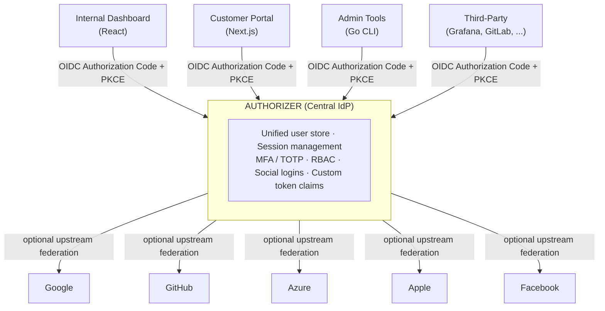

# SSO — One-Stop Authentication for All Your Apps

Authorizer can serve as the **central Single Sign-On (SSO) Identity Provider** for every application in your organization. Instead of each app managing its own user accounts and login flows, all apps delegate authentication to one Authorizer instance. Users sign in once and get seamless access everywhere.

## Architecture Overview



Every app talks to Authorizer using standard **OIDC Discovery**. Point your app at `https://auth.yourcompany.com/.well-known/openid-configuration` and the client library auto-discovers all endpoints.

---

## Why Use Authorizer as Your SSO

| Benefit | Details |
|---------|---------|
| **Single user store** | One account per person across all apps. No duplicate credentials, no sync headaches. |
| **One login, all apps** | Session cookie means users authenticate once. Subsequent apps get silent SSO via `prompt=none`. |
| **Centralized MFA** | [TOTP](https://datatracker.ietf.org/doc/html/rfc6238), email OTP, or SMS OTP configured once per user, enforced everywhere. |
| **Unified roles** | Assign roles centrally; each app reads the `roles` claim from the JWT and enforces its own authorization. |
| **Self-hosted & sovereign** | Your infrastructure, your data. No third-party vendor sees your user credentials. |
| **Standards-based** | Full OIDC Core 1.0, OAuth 2.0, PKCE, token introspection, revocation. Any OIDC-compliant library works. |
| **13+ database backends** | PostgreSQL, MySQL, MongoDB, DynamoDB, SQLite, and more. Use the database you already run. |

---

## Step-by-Step Setup

### 1. Deploy Authorizer

Deploy a single Authorizer instance as your organization's IdP. See the [Deployment guide](/deployment) for options (Docker, Kubernetes, Helm, binary, cloud platforms).

Configure the essentials:

```bash
authorizer \
  --database-type postgres \
  --database-url "postgres://user:pass@db:5432/authorizer" \
  --url https://auth.yourcompany.com \
  --http-port 8080 \
  --allowed-origins "https://app1.yourcompany.com,https://app2.yourcompany.com,https://admin.yourcompany.com" \
  --organization-name "YourCompany" \
  --smtp-host "smtp.yourcompany.com" \
  --smtp-port 587 \
  --smtp-username "auth@yourcompany.com" \
  --smtp-password "..." \
  --smtp-sender-email "auth@yourcompany.com" \
  --jwt-type RS256 \
  --jwt-private-key "$(cat jwt-private.pem)" \
  --jwt-public-key "$(cat jwt-public.pem)" \
  --encryption-key your-encryption-key \
  --client-id YOUR_CLIENT_ID \
  --client-secret YOUR_CLIENT_SECRET \
  --admin-secret YOUR_ADMIN_SECRET
```

Key flags for SSO:
- `--allowed-origins` — Whitelist all app domains that will redirect to Authorizer for login.
- `--jwt-type` and `--jwt-secret` / `--jwt-private-key` — Configure token signing (RS256 recommended for multi-app setups since apps verify with the public key via JWKS).
- `--encryption-key` — Encrypts TOTP secrets and OTP digests at rest. **Required with `RS*`/`ES*`** (2.4.0+): there is no `--jwt-secret` to fall back to, so the server refuses to start without it.

### 2. Note Your Client Credentials

After starting Authorizer, retrieve the `client_id` and `client_secret` from the admin dashboard or server logs. Every app connecting to this Authorizer instance uses these credentials.

### 3. Connect Your Apps

Each app needs just four values:

```
OIDC Issuer URL:    https://auth.yourcompany.com
Client ID:          <your_client_id>
Client Secret:      <your_client_secret>
Scopes:             openid email profile
```

---

## Integration Examples

### React / JavaScript App (using authorizer-react SDK)

```jsx
import { AuthorizerProvider, Authorizer } from "@authorizerdev/authorizer-react";

function App() {
  return (
    <AuthorizerProvider
      config={{
        authorizerURL: "https://auth.yourcompany.com",
        redirectURL: "https://app1.yourcompany.com",
        clientID: "YOUR_CLIENT_ID",
      }}
    >
      <Authorizer />
    </AuthorizerProvider>
  );
}
```

### Any OIDC-Compliant Library (Generic)

```javascript
// Works with openid-client, oidc-client-ts, next-auth, passport-openidconnect, etc.
const config = {
  authority: "https://auth.yourcompany.com",
  client_id: "YOUR_CLIENT_ID",
  client_secret: "YOUR_CLIENT_SECRET",
  redirect_uri: "https://myapp.yourcompany.com/callback",
  scope: "openid email profile offline_access",
  response_type: "code",
};
// Discovery handles the rest — all endpoints are auto-discovered.
```

### Server-Side App (Go, Python, Java, etc.)

Any language with an OIDC library can connect. The flow:

1. Redirect the user to `https://auth.yourcompany.com/authorize?client_id=...&redirect_uri=...&scope=openid email profile&response_type=code&state=...&code_challenge=...&code_challenge_method=S256`
2. User logs in at Authorizer (or gets silent SSO if already authenticated).
3. Authorizer redirects back to your app with an authorization `code`.
4. Your backend exchanges the code for tokens at `/oauth/token`.
5. Validate the `id_token` using the JWKS from `/.well-known/jwks.json`.

### Third-Party Tools

Many tools support "Login with OIDC" out of the box. Examples:

| Tool | Configuration |
|------|--------------|
| **Grafana** | Set `[auth.generic_oauth]` with `auth_url`, `token_url`, `api_url` from Authorizer's discovery endpoint. |
| **GitLab** | Use the OmniAuth [OpenID Connect](https://openid.net/specs/openid-connect-core-1_0.html) provider with Authorizer's issuer URL. |
| **HashiCorp Vault** | Configure the OIDC auth method with Authorizer as the provider. |
| **MinIO** | Set `MINIO_IDENTITY_OPENID_CONFIG_URL` to Authorizer's discovery URL. |
| **Kubernetes** | Use `--oidc-issuer-url` flag on the API server for OIDC-based kubectl authentication. |

---

## How Session Sharing Works (Silent SSO)

Once a user authenticates with Authorizer, a session cookie is set on the Authorizer domain. When the user navigates to another app:

1. The app redirects to Authorizer's `/authorize` endpoint with `prompt=none`.
2. Authorizer detects the existing session cookie.
3. Authorizer immediately redirects back with an authorization code — **no login screen shown**.
4. The app exchanges the code for tokens.

This creates a seamless experience: the user logs in once at Authorizer and is automatically signed into every connected app.

### Force Re-Authentication

For sensitive operations, apps can pass `prompt=login` to force the user to re-authenticate even if they have an active session.

---

## Security Features You Get for Free

### Multi-Factor Authentication (MFA)

Enable TOTP, email OTP, or SMS OTP globally. Users configure MFA once and it protects access to all apps.

### PKCE (Proof Key for Code Exchange)

Enforced for public clients (SPAs, mobile apps). Prevents authorization code interception attacks. Authorizer supports both `S256` and `plain` methods.

### Role-Based Access Control (RBAC)

Assign roles to users in Authorizer (e.g., `admin`, `editor`, `viewer`). The `roles` claim is included in every JWT. Each app reads the roles and enforces its own authorization:

```json
{
  "sub": "user_123",
  "email": "jane@yourcompany.com",
  "roles": ["admin", "billing"],
  "iss": "https://auth.yourcompany.com",
  "aud": "your_client_id"
}
```

### Custom Access Token Claims

Use Authorizer's custom access token script (JavaScript) to add app-specific claims to JWTs:

```javascript
// Example: add department and team claims from user metadata
function(user, tokenPayload) {
  tokenPayload.department = user.app_data?.department;
  tokenPayload.team = user.app_data?.team;
  return tokenPayload;
}
```

### Backchannel Logout

When a user logs out from one app, Authorizer can notify all other apps via OIDC Back-Channel Logout. Configure with:

```bash
--backchannel-logout-uri "https://app1.yourcompany.com/backchannel-logout"
```

Authorizer sends a signed `logout_token` JWT to the configured URI, allowing all apps to invalidate their local sessions.

### Token Verification

Apps can verify tokens in two ways:

| Method | When to Use |
|--------|-------------|
| **JWKS verification** (offline) | Validate JWTs locally using public keys from `/.well-known/jwks.json`. Fast, no network call per request. |
| **Token introspection** (online) | Call `/oauth/introspect` to check if a token is still active. Use for refresh token validation or when you need real-time revocation checks. |

---

## Supported Authentication Methods

Authorizer supports multiple login methods, all managed centrally:

| Method | Description |
|--------|-------------|
| **Email + Password** | Classic signup/login with email verification |
| **Magic Links** | Passwordless login via email link |
| **Email OTP** | One-time password sent to email |
| **SMS OTP** | One-time password sent via SMS ([Twilio](https://www.twilio.com)) |
| **TOTP** | Time-based one-time password (Google Authenticator, Authy) |
| **Social Logins** | Google, GitHub, Facebook, LinkedIn, Apple, Discord, Twitter, Microsoft, Twitch, Roblox |

Users choose their preferred method. The `amr` (Authentication Methods Reference) claim in the JWT tells your app how the user authenticated:
- `pwd` — password
- `otp` — magic link or OTP
- `fed` — social/federated login

---

## Connecting to Enterprise Identity Providers

Authorizer can federate with enterprise identity providers. If your organization already uses Azure AD, Okta, or Google Workspace, users can log in with their corporate credentials through Authorizer's social login configuration:

- **Microsoft Azure AD** — Configure with `--microsoft-client-id`, `--microsoft-client-secret`, and `--microsoft-tenant-id`.
- **Google Workspace** — Use the standard Google OAuth config. Restrict to your domain via Google's console.

Authorizer acts as the intermediary: corporate users log in via their existing IdP, and Authorizer issues unified tokens that all your apps consume.

---

## Response Modes for Different App Types

| App Type | Response Mode | How It Works |
|----------|---------------|--------------|
| **Server-side web apps** | `query` | Authorization code returned as URL query parameter. Most secure. |
| **Single Page Apps (SPAs)** | `web_message` | Tokens delivered via HTML5 `postMessage`. No page reload. |
| **SPAs (legacy)** | `fragment` | Tokens in URL fragment (implicit flow). |
| **Enterprise IdP integrations** | `form_post` | Auto-submitting HTML form POSTs tokens to your server. |

---

## Endpoints Reference

All endpoints are auto-discoverable via OIDC Discovery, but here's a quick reference:

| Endpoint | Purpose |
|----------|---------|
| `/.well-known/openid-configuration` | OIDC Discovery — auto-discover all endpoints |
| `/.well-known/jwks.json` | Public keys for JWT verification |
| `/authorize` | Start login flow (Authorization Code + PKCE) |
| `/oauth/token` | Exchange code for tokens / refresh tokens |
| `/userinfo` | Get authenticated user's profile |
| `/oauth/revoke` | Revoke a refresh token |
| `/oauth/introspect` | Check if a token is active |
| `/logout` | RP-initiated logout |

For detailed endpoint documentation, see the [OAuth 2.0 & OIDC reference](/core/oauth2-oidc).

---

## Enterprise & Workload Identity Features

Several capabilities that used to live on this page's roadmap have shipped. Each has its own reference page:

### Client Registry (Multiple Clients)

Authorizer maintains a client registry: admins can register additional clients — machine service accounts with their own `client_id`, one-time-revealed `client_secret`, and a per-client scope allow-list — alongside the reserved interactive client. Service accounts authenticate via the OAuth2 `client_credentials` grant. See the [Client Registry guide](./client-registry).

> Programmatic *self-service* registration (RFC 7591 Dynamic Client Registration) ships in 2.4.0 but is **off by default** and is scoped to public MCP-style clients — see [Self-registering clients](./mcp#self-registering-clients-cimd-vs-dcr). For everything else, clients are registered by an admin via the admin API or dashboard.

### Organizations

Model tenants as organizations with per-org members and per-org roles, and attach per-org SSO and SCIM connections to them. See [Organizations](../enterprise/organizations).

### Per-Organization SAML 2.0 SSO (SP)

Authorizer acts as a [SAML 2.0](https://www.oasis-open.org/standard/saml/) Service Provider per organization: register a corporate IdP's entity ID, SSO URL, and signing certificate, and that org's users log in through their IdP with JIT provisioning. See [SAML SSO](../enterprise/org-saml).

### SAML 2.0 Identity Provider (IdP)

The architectural inverse of the SP role above: per organization, Authorizer can also act as a **SAML 2.0 Identity Provider**, issuing signed assertions to downstream Service Providers (Zendesk, Salesforce, Notion, …) so their SAML-based SSO logs users in with their existing Authorizer session. Each org gets its own SAML signing keypair with `current` / `active` / `retired` rotation states, and both SP-initiated and opt-in IdP-initiated flows are supported. See [SAML Identity Provider](../enterprise/saml-idp).

### SAML 2.0 Identity Provider (IdP)

The architectural inverse of the SP role above: per organization, Authorizer can also act as a **SAML 2.0 Identity Provider**, issuing signed assertions to downstream Service Providers (Zendesk, Salesforce, Notion, …) so their SAML-based SSO logs users in with their existing Authorizer session. Each org gets its own SAML signing keypair with `current` / `active` / `retired` rotation states, and both SP-initiated and opt-in IdP-initiated flows are supported. See [SAML Identity Provider](../enterprise/saml-idp).

### Per-Organization OIDC SSO (Broker)

The OIDC sibling of the SAML SP: Authorizer brokers a per-org upstream OIDC IdP (Okta, Entra ID, Google Workspace) as a Relying Party. See [OIDC SSO](../enterprise/org-sso-oidc).

### Verified Domains & Home Realm Discovery

Organizations can prove ownership of an email domain — via a DNS TXT challenge, or a trusted-assert shortcut for super-admins — so a login for `jane@acme.com` is automatically routed to Acme's SAML or OIDC connection instead of the generic login form. This routing lookup is called Home Realm Discovery (HRD) and is exposed at the public `/api/v1/org-discovery` endpoint (opt-in, off by default). A verified domain only ever affects routing — it never grants org membership and never blocks login. See [Verified Domains & Home Realm Discovery](../enterprise/org-domains).

### SCIM 2.0 Provisioning (RFC 7644)

Per-org inbound [SCIM 2.0](https://datatracker.ietf.org/doc/html/rfc7644) endpoints let enterprise directories (Okta, Microsoft Entra ID, OneLogin) provision and deprovision users automatically. Deactivation synchronously revokes sessions and refresh tokens. See [SCIM Provisioning](../enterprise/scim).

### Workload Identity & Delegation

Machines can authenticate without stored secrets (Kubernetes ServiceAccount tokens, [SPIFFE](https://spiffe.io) JWT-SVIDs — see [Workload Identity](../enterprise/workload-identity)), and agents can act on behalf of users with attenuated, audience-bound tokens via [RFC 8693](https://datatracker.ietf.org/doc/html/rfc8693) token exchange (see [Token Exchange](../enterprise/token-exchange)).

---

## Future Roadmap

Still planned for future releases:

### Dynamic Client Registration (RFC 7591)

Self-service programmatic client registration (the `registration_endpoint`) is available from 2.4.0 behind `--enable-dynamic-client-registration`, and is deliberately narrow: it registers **public** clients only, for the MCP onboarding case. Confidential clients are still created by an admin through the [client registry](./client-registry) admin API. See [Self-registering clients](./mcp#self-registering-clients-cimd-vs-dcr).

### LDAP / Active Directory Integration

Direct LDAP/AD integration will allow Authorizer to authenticate users against existing corporate directories without requiring federation through Azure AD or Google Workspace.

### Front-Channel Logout (OIDC)

In addition to the already-supported backchannel logout, front-channel logout will add browser-based logout propagation via hidden iframes for apps that cannot expose a backchannel endpoint.

### Automated JWKS Key Rotation

Time-based automatic rotation of JWT signing keys with configurable rotation periods, eliminating the need for manual key rotation. (Zero-downtime *manual* rotation via secondary keys is already supported — see the [OAuth 2.0 & OIDC reference](/core/oauth2-oidc).)

---

## Summary

Authorizer gives you a **self-hosted, single-binary SSO server** that speaks standard OIDC. Any app — internal tool, customer portal, or third-party service — can authenticate against it. Users get one account, one login, one MFA setup. You get full control over your identity data with no per-user SaaS fees.

| What You Get Today | What's Coming |
|---|---|
| Full OIDC IdP with discovery | Dynamic client registration for *confidential* clients (RFC 7591 covers public clients only) |
| 10+ social login providers | LDAP/AD integration |
| MFA (TOTP, email OTP, SMS OTP) | Front-channel logout |
| RBAC with JWT claims | Automated JWKS rotation |
| Backchannel logout | |
| Token introspection & revocation | |
| 13+ database backends | |
| Custom access token scripts | |
| [Client registry](./client-registry) + `client_credentials` grant | |
| [Organizations](../enterprise/organizations) with per-org members & roles | |
| [Per-org SAML 2.0 SP](../enterprise/org-saml), [SAML 2.0 IdP](../enterprise/saml-idp) & [OIDC broker SSO](../enterprise/org-sso-oidc) | |
| [Verified domains & Home Realm Discovery](../enterprise/org-domains) | |
| [SCIM 2.0 provisioning](../enterprise/scim) | |
| [Workload identity](../enterprise/workload-identity) (K8s, SPIFFE) | |
| [RFC 8693 token exchange](../enterprise/token-exchange) (delegation) | |
