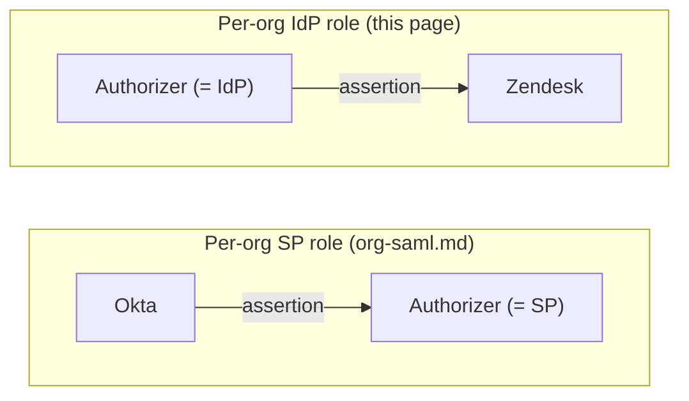

# SAML 2.0 Identity Provider (IdP)

Per [organization](./organizations), Authorizer can also act as a **SAML 2.0 Identity Provider** — issuing signed assertions to downstream Service Providers (Zendesk, Salesforce, Notion, …) so their SAML-based SSO logs users in with their existing Authorizer session. This is the architectural inverse of [Authorizer as SAML SP](./org-saml): there Authorizer *consumes* an assertion from a corporate IdP; here it *produces* one for a downstream SP. Do not confuse the two — a `SAMLServiceProvider` row (this page) and an `OrgSAMLConnection` row (the SP-role doc) are unrelated tables.



## Endpoints (per org)

| Endpoint | Method | Purpose |
|----------|--------|---------|
| `/saml/idp/{org_slug}/metadata` | GET | IdP metadata XML — import this at the downstream SP |
| `/saml/idp/{org_slug}/sso` | GET, POST | SP-initiated SSO — receives the SP's `AuthnRequest` (HTTP-Redirect or HTTP-POST binding) |
| `/saml/idp/{org_slug}/sso/{sp_id}` | GET | IdP-initiated SSO — unsolicited assertion POSTed to the SP identified by `sp_id`, gated by that SP's `allow_idp_initiated` flag |

All three resolve the org by `org_slug`; an SP registered for one org is never reachable through another org's endpoints.

## Registering a downstream SP

Admin operations (super-admin or org-admin of `org_id`), available via GraphQL, gRPC (`AuthorizerAdminService`), and the dashboard (**Organization → SAML Service Providers**):

| GraphQL operation | Type | gRPC / REST-gateway | Purpose |
|--------------------|------|----------------------|---------|
| `_create_saml_service_provider` | mutation | `CreateSamlServiceProvider` · `POST /v1/admin/create_saml_service_provider` | Register a downstream SP |
| `_update_saml_service_provider` | mutation | `UpdateSamlServiceProvider` · `POST /v1/admin/update_saml_service_provider` | Update name, `entity_id`, `acs_url`, cert, attribute mapping, `allow_idp_initiated`, `is_active` |
| `_delete_saml_service_provider` | mutation | `DeleteSamlServiceProvider` · `POST /v1/admin/delete_saml_service_provider` | Remove a registered SP |
| `_saml_service_provider` | query | `GetSamlServiceProvider` · `POST /v1/admin/saml_service_provider` | Fetch one SP by `id` |
| `_list_saml_service_providers` | query | `ListSamlServiceProviders` · `POST /v1/admin/saml_service_providers` | Paginated list for an org |
| `_import_saml_sp_metadata` | mutation | `ImportSamlSpMetadata` · `POST /v1/admin/import_saml_sp_metadata` | Parse pasted SP metadata XML into `entity_id` / `acs_url` / certificate (does **not** create a record — prefill only; super-admin only, no remote fetch) |

```graphql
mutation {
  _create_saml_service_provider(
    params: {
      org_id: "ORG_ID"
      name: "Zendesk prod"
      entity_id: "https://acme.zendesk.com/sso/saml"
      acs_url: "https://acme.zendesk.com/access/saml"
      # sp_cert_pem: optional SP signing certificate (PEM)
      # name_id_format: defaults to urn:oasis:names:tc:SAML:1.1:nameid-format:emailAddress
      # mapped_attributes: optional JSON, e.g.
      #   "{\"email\":\"email\",\"given_name\":\"firstName\",\"groups\":\"memberOf\"}"
      # allow_idp_initiated: defaults to false (SP-initiated only)
    }
  ) {
    id
    entity_id
    acs_url
    allow_idp_initiated
    is_active
  }
}
```

`entity_id` is unique within the org — `(org_id, entity_id)` is the lookup that resolves an incoming `AuthnRequest` to this record, and it also fixes the assertion's `Audience`. `acs_url` is the **only** place an assertion is ever POSTed; a request-supplied ACS URL that doesn't match this value is rejected.

## Attribute mapping

`mapped_attributes` is JSON mapping Authorizer profile fields to the SAML attribute **names** this SP expects — the inverse of the SP-role's `attribute_mapping`. Defaults when omitted:

| Authorizer field | Default SAML attribute |
|------------------|------------------------|
| `email` | `email` (only ever emitted once the user's email is verified) |
| `given_name` | `given_name` |
| `family_name` | `family_name` |
| `nickname` | `nickname` |
| `picture` | `picture` |

### Group assertion (SCIM groups → SAML `groups`)

If the user belongs to [SCIM groups](./scim) in the issuing org, their group display names are emitted as one multi-valued attribute (default name `groups`, or a `groups` key in `mapped_attributes`). This is gated to the issuing org's namespace only — a group from a different org the user also belongs to can never appear in the assertion. See the [SCIM doc](./scim) for how groups and memberships are managed; this page only covers the SAML projection.

## Signing key rotation

Each org gets its own RSA signing keypair (`SAMLIDPKey`), generated lazily on first use — independent of the JWT signing key, since XML-DSIG needs the X.509 certificate wrapper. A key's `status` is one of:

| Status | Meaning |
|--------|---------|
| `current` | The single key new assertions are signed with. At most one per org. |
| `active` | A formerly-current key, still published in IdP metadata so SPs with cached metadata keep validating during the rotation overlap. Never signs. |
| `retired` | Explicitly retired by an admin — no longer published, no longer usable. Retirement is always an explicit action, never time-based. |

Admin operations:

| GraphQL operation | Type | Purpose |
|--------------------|------|---------|
| `_rotate_saml_idp_cert` | mutation | Generate a new keypair as `current`; the previous `current` key is demoted to `active` |
| `_retire_saml_idp_key` | mutation | Retire an `active` key (an org's `current` key cannot be retired — rotate first) |
| `_list_saml_idp_keys` | query | List an org's keys with their `status` (private key is never projected) |

```graphql
mutation {
  _rotate_saml_idp_cert(params: { org_id: "ORG_ID" }) {
    id
    status
    algorithm
  }
}
```

Recommended rotation workflow: call `_rotate_saml_idp_cert`, wait for downstream SPs to refresh their cached copy of `/saml/idp/{org_slug}/metadata` (both certs are published during the overlap), then call `_retire_saml_idp_key` on the old key once you've confirmed nothing still needs it.

## Security model

| Invariant | Enforcement |
|-----------|-------------|
| ACS/EntityID strict binding | The SP is resolved from the registered `SAMLServiceProvider` row by the `AuthnRequest` issuer; the ACS URL is taken **only** from that row, never from the request — closes the open-redirect / assertion-exfiltration path. An unregistered SP is refused. |
| Audience isolation | The assertion `Audience` is set to the resolved SP's `entity_id`, so an assertion minted for SP-A can never validate at SP-B. |
| Org-membership gating | The authenticated user must be a member of the org the assertion is minted for. Without this, any logged-in Authorizer user could hit another org's `/saml/idp/{org}/sso` and get an assertion signed by that org's key. Absent-or-errored membership is treated as denied (fail-closed), never silently allowed. |
| Verified-email gating | When the Subject `NameID` (or the `email` attribute) would be the user's email address, that email must be verified — otherwise a member could register `victim@org.com` and be asserted as the victim to an SP that keys off email. |
| IdP-initiated gating | Unsolicited (IdP-initiated) SSO is refused unless the SP's `allow_idp_initiated` is `true`. Default is `false` (SP-initiated only). |
| RelayState bound | IdP-initiated `RelayState` is capped at 2048 bytes and dropped (not rejected) above that — it is only ever reflected into the delivered response form, never treated as a redirect target. |
| Signing scope | Signing uses only the org's `current` key; metadata additionally publishes `active` certs so a rotation overlap doesn't break SPs with cached metadata. |
| No unauthenticated issuance | SP-initiated flows only produce an assertion once the browser presents a valid Authorizer session; otherwise the request bounces through the normal login UI and resumes via an opaque, single-use continuation token — never a request-supplied redirect. |

### IdP-initiated SSO

`GET /saml/idp/{org_slug}/sso/{sp_id}` POSTs an unsolicited assertion straight to the SP's ACS — there's no `AuthnRequest` to bind an `InResponseTo` to, so replay defense for this path is the **consuming SP's** job (single-use `AssertionID`); Authorizer bounds exposure with a tight `NotBefore`/`NotOnOrAfter` window. Only enable `allow_idp_initiated` for SPs that support unsolicited assertions.
